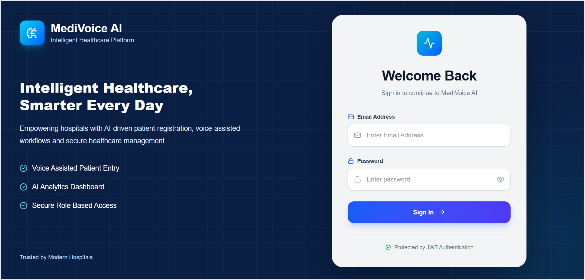
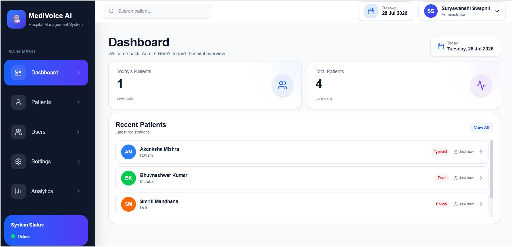
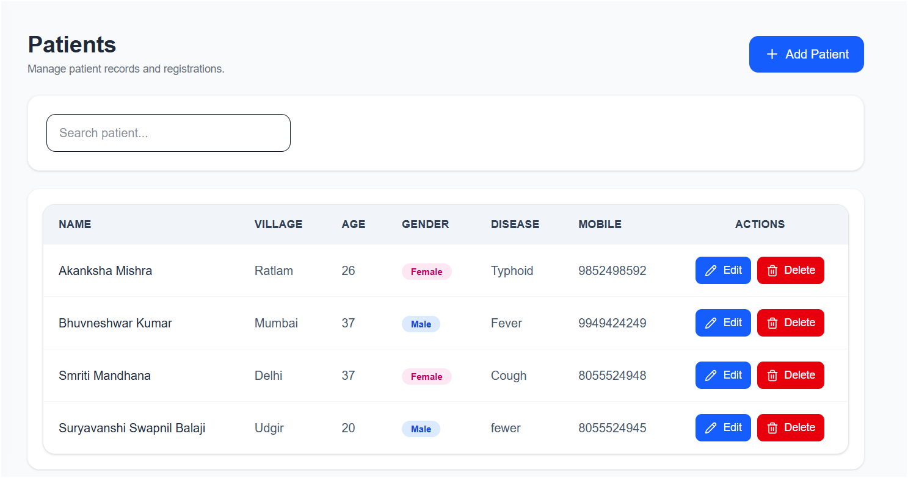
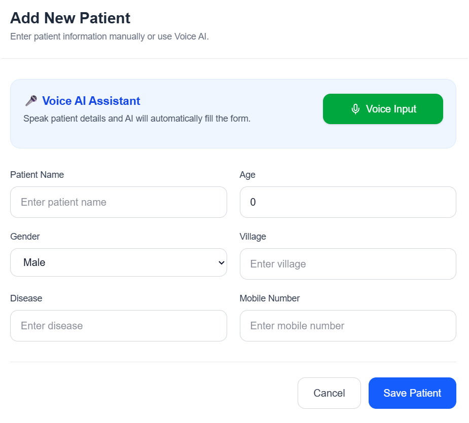
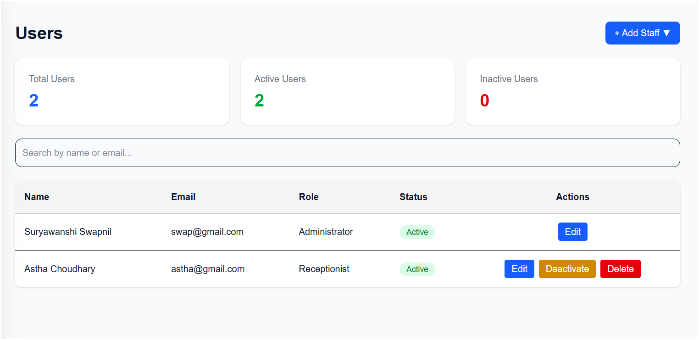
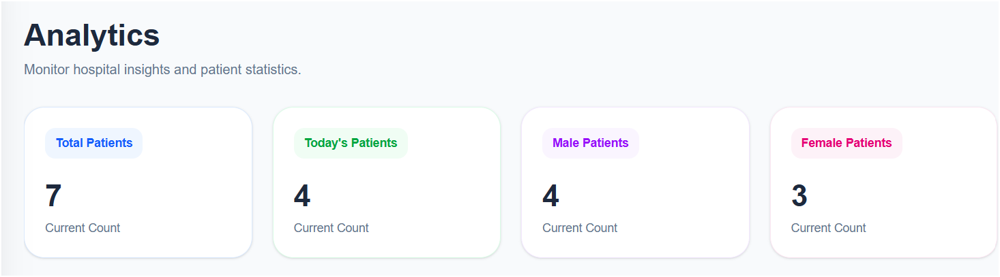
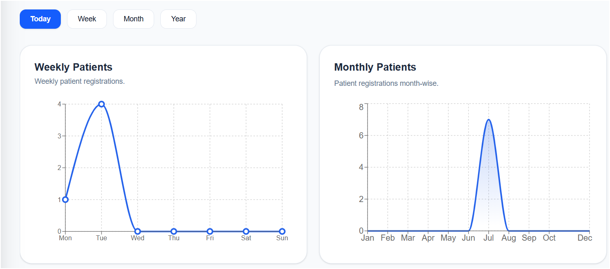
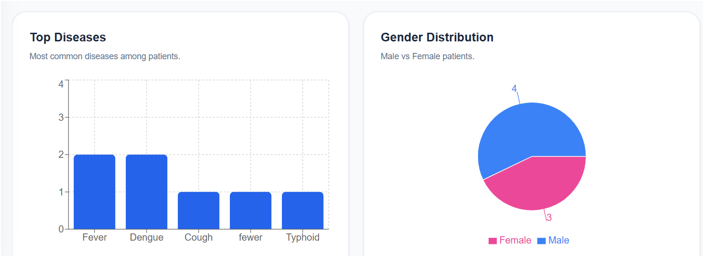

<div align="center">

# 🏥 MediVoice AI

### AI-Powered Hospital Management System

A full-stack hospital management application with patient management, analytics, secure authentication, settings, and AI-assisted voice workflows.

<br/>

[](https://react.dev/)
[](https://www.typescriptlang.org/)
[](https://vite.dev/)
[](https://tailwindcss.com/)
[](https://fastapi.tiangolo.com/)
[](https://www.python.org/)
[](https://www.postgresql.org/)

</div>

---

## 📌 Overview

**MediVoice AI** is a full-stack hospital management system built to simplify common hospital workflows through a modern web interface, REST APIs, secure authentication, patient management, analytics, settings management, and AI-assisted voice functionality.

The application uses a React frontend, FastAPI backend, PostgreSQL database, and SQLAlchemy ORM, with JWT-based authentication for protected access.

---

## ✨ Features

### 🔐 Authentication

* JWT-based login
* Secure password hashing with bcrypt
* Protected application routes
* Role-based access
* Current-user authentication
* Logout and session persistence

### 👥 Patient Management

* Add patients
* View patients
* Search patient records
* Update patient information
* Delete patient records
* Patient details and management interface

### 📊 Dashboard

* Patient statistics
* Today's patient count
* Total patients
* Active cases
* Voice status
* Dashboard overview

### 📈 Analytics

* Analytics summary
* Weekly patient analytics
* Monthly patient analytics
* Top diseases
* Gender-based patient statistics
* Interactive charts

### 👤 User Management

* Administrator access
* Receptionist access
* User management interface
* Role-based access control

### 🎤 Voice AI

* Voice-assisted patient workflow
* Voice transcript processing
* AI-assisted voice functionality
* Google Gemini integration

### ⚙️ Settings

* Hospital information
* Admin profile
* Voice AI settings
* Database information
* Application settings

---

## 🛠️ Tech Stack

### Frontend

* React
* TypeScript
* Vite
* Tailwind CSS
* React Router
* Axios
* Lucide React
* React Toastify

### Backend

* Python
* FastAPI
* SQLAlchemy
* Pydantic
* JWT
* Passlib / bcrypt

### Database

* PostgreSQL

### AI

* Google Gemini AI

### Development

* Git
* GitHub
* VS Code
* Swagger UI

---

## 🏗️ Architecture

```text
                         MediVoice AI
                              │
                    ┌─────────┴─────────┐
                    │                   │
              React Frontend       FastAPI Backend
                    │                   │
              React Router        REST API Routers
                    │                   │
              Axios Services       SQLAlchemy ORM
                    │                   │
                    └─────────┬─────────┘
                              │
                         PostgreSQL
                              │
                              └────── Google Gemini AI
```

---

## 📂 Project Structure

```text
MediVoice-AI/
│
├── backend/
│   ├── app/
│   │   ├── ai/
│   │   ├── auth/
│   │   ├── routers/
│   │   │   ├── analytics.py
│   │   │   ├── dashboard.py
│   │   │   ├── database.py
│   │   │   ├── patients.py
│   │   │   ├── settings.py
│   │   │   └── voice.py
│   │   ├── crud.py
│   │   ├── database.py
│   │   ├── main.py
│   │   ├── models.py
│   │   └── schemas.py
│   │
│   └── requirements.txt
│
├── frontend/
│   ├── src/
│   │   ├── components/
│   │   │   ├── analytics/
│   │   │   ├── auth/
│   │   │   ├── common/
│   │   │   ├── dashboard/
│   │   │   ├── layout/
│   │   │   ├── patient/
│   │   │   ├── reports/
│   │   │   ├── speech/
│   │   │   └── ui/
│   │   │
│   │   ├── context/
│   │   ├── layouts/
│   │   ├── pages/
│   │   │   ├── analytics/
│   │   │   ├── auth/
│   │   │   ├── dashboard/
│   │   │   ├── patients/
│   │   │   ├── profile/
│   │   │   └── settings/
│   │   │
│   │   ├── routes/
│   │   ├── services/
│   │   ├── types/
│   │   ├── App.tsx
│   │   ├── main.tsx
│   │   └── index.css
│   │
│   ├── package.json
│   └── vite.config.ts
│
├── docs/
│   ├── login.png
│   ├── dashboard.png
│   ├── patient_management.png
│   ├── add_new_patient.png
│   ├── users.png
│   ├── analytics1.png
│   ├── analytics2.png
│   └── analytics3.png
│
├── .gitignore
├── LICENSE
└── README.md
```

---

## 📸 Screenshots

### 🔐 Login

<p align="center">
  
</p>

### 📊 Dashboard

<p align="center">
  
</p>

### 👥 Patient Management

<p align="center">
  
</p>

### ➕ Add New Patient

<p align="center">
  
</p>

### 👤 User Management

<p align="center">
  
</p>

### 📈 Analytics

<p align="center">
  
</p>

<p align="center">
  
</p>

<p align="center">
  
</p>

---

## ⚙️ Setup

### 1. Clone the Repository

```bash
git clone https://github.com/jarvissi18/MediVoice-AI.git
cd MediVoice-AI
```

### 2. Backend Setup

```bash
cd backend
python -m venv .venv
```

#### Windows

```bash
.venv\Scripts\activate
```

#### Linux / macOS

```bash
source .venv/bin/activate
```

Install dependencies:

```bash
pip install -r requirements.txt
```

Create the backend `.env` file with your local PostgreSQL and AI configuration.

Start the backend:

```bash
uvicorn app.main:app --reload
```

Backend:

```text
http://127.0.0.1:8000
```

Swagger:

```text
http://127.0.0.1:8000/docs
```

### 3. Frontend Setup

Open another terminal:

```bash
cd frontend
npm install
npm run dev
```

Frontend:

```text
http://localhost:5173
```

---

## 🗄️ Database

MediVoice AI uses **PostgreSQL** with **SQLAlchemy**.

The current application stores:

* Patient records
* Application settings
* User accounts

The backend creates the required SQLAlchemy tables when the application starts.

---

## 🔒 Authentication

Authentication is implemented using:

* JWT access tokens
* bcrypt password hashing
* Protected frontend routes
* Role-based route protection
* Auth context for session state
* Axios authentication headers

The current application supports **Administrator** and **Receptionist** roles.

---

## 🔗 Backend API Modules

```text
/auth
/patients
/dashboard
/analytics
/settings
/database
/voice
```

API documentation is available through FastAPI Swagger at:

```text
http://127.0.0.1:8000/docs
```

---

## 🧪 Current Workflow

```text
Login
  │
  ▼
Authentication
  │
  ▼
Dashboard
  │
  ├── Patients
  │
  ├── Analytics
  │
  ├── User Management
  │
  ├── Settings
  │
  └── Voice AI
```

---

## 📄 License

This project is licensed under the **MIT License**.

See the `LICENSE` file for details.

---

## 👨‍💻 Author

### Suryawanshi Swapnil

Computer Engineering Student

GitHub:
https://github.com/jarvissi18

---

<div align="center">

### 🏥 MediVoice AI

**Intelligent Healthcare. Smarter Every Day.**

Built with React, FastAPI, PostgreSQL and AI.

© 2026 Suryawanshi Swapnil

</div>
